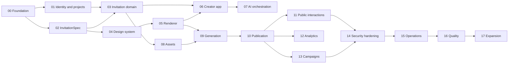

# AI Tasks — Invite.md Implementation Backlog

This folder breaks the full Invite.md platform into small, ordered, AI-executable tasks derived from the documentation in [docs/](../).

Each task is a single markdown file with a goal, scope, deliverables, acceptance criteria, tests, dependencies and links to the source documents.

## How an AI agent executes a task

1. Read [AGENTS.md](../../AGENTS.md) and [CONVENTIONS.md](../CONVENTIONS.md).
2. Pick a task whose **Depends on** tasks are all `done`.
3. Read every document linked in the task's **Docs** field.
4. Set the task status to `in-progress`.
5. Implement only the task's scope. Do not silently expand it.
6. Satisfy every acceptance criterion and write the listed tests.
7. Run typecheck, lint and tests.
8. Update documentation if a contract, model, invariant or architecture changed.
9. Create or update an ADR when the task makes an expensive-to-reverse decision.
10. Set the task status to `done`.

## Mandatory coding rules

- React components are `const` arrow functions only.
- Atomic files, maximum 500 lines each.
- File and folder names are kebab-case.
- No comments in code.
- Never use `any` or `as any`; strong, strict TypeScript typing.
- User-facing creator strings come from the translations package, never hardcoded.

## Core invariant

```text
Conversation -> structured answers -> InvitationSpec -> validation -> renderer -> build -> artifact validation -> publish
```

AI produces validated, versioned data. Trusted code renders it. AI never executes arbitrary production code.

## Status values

| Status        | Meaning                                 |
| ------------- | --------------------------------------- |
| `todo`        | Not started                             |
| `in-progress` | Being implemented                       |
| `blocked`     | Waiting on a decision or dependency     |
| `review`      | Implemented, awaiting review            |
| `done`        | Merged and acceptance criteria verified |

## Priority values

| Priority | Meaning                    |
| -------- | -------------------------- |
| P0       | MVP critical path          |
| P1       | MVP / production readiness |
| P2       | Post-MVP or optional       |

## Package naming

Package and app names follow [IMPLEMENTATION.md](../IMPLEMENTATION.md) §1 until [T00.01](00-foundation/00-01-resolve-documentation-conflicts.md) confirms or changes them.

```text
apps/creator  apps/api  apps/worker  apps/public-edge  apps/public-interactions
packages/contracts  packages/domain  packages/invitation-spec  packages/design-system
packages/invitation-runtime  packages/themes  packages/ai  packages/storage  packages/queue
packages/config  packages/analytics  packages/testing  packages/shared  packages/translations
packages/observability  packages/database
```

## Phase flow



Phases describe the recommended order from [ROADMAP.md](../ROADMAP.md). The real constraint is each task's **Depends on** field.

New tasks should copy [task-template.md](task-template.md).

## Summary

- Total tasks: **203**
- P0: **157** · P1: **37** · P2: **9**

## Phases

| Phase                                                        | Tasks | Exit condition                                                                                                                         |
| ------------------------------------------------------------ | ----- | -------------------------------------------------------------------------------------------------------------------------------------- |
| [00 — Foundation](00-foundation/README.md)                   | 30    | Services start locally, contracts compile, CI runs typecheck, lint, tests and build.                                                   |
| [01 — Identity and projects](01-identity-projects/README.md) | 10    | An authenticated user can create a project, invite members with roles and every project-scoped request is authorized server-side.      |
| [02 — InvitationSpec](02-invitation-spec/README.md)          | 23    | Golden fixture specs validate, normalize, hash deterministically and reject malicious or invalid input.                                |
| [03 — Invitation domain](03-invitation-domain/README.md)     | 11    | A manually created InvitationSpec can be stored as a version, patched with revision checks and restored from history through the API.  |
| [04 — Design system](04-design-system/README.md)             | 21    | Creator components and invitation primitives exist, themes resolve to tokens and the capability manifest is generated from registries. |
| [05 — Invitation renderer](05-renderer/README.md)            | 19    | Every golden fixture renders deterministically through the trusted registry, accessibly and responsively.                              |
| [06 — Creator application](06-creator-app/README.md)         | 18    | A user can sign in, create an invitation, see a live preview of a manually created spec, browse versions and reach every primary area. |
| [07 — AI orchestration](07-ai-orchestration/README.md)       | 28    | A user can create and revise an invitation conversationally; every AI output is validated before it changes the spec.                  |
| [08 — Assets](08-assets/README.md)                           | 14    | Uploaded media is validated, processed into variants and referenced from specs; nothing unsafe or orphaned remains.                    |
| [09 — Generation Pipeline](09-generation-pipeline/README.md) | 4     | A robust, isolated generation pipeline that safely produces valid structured data from conversational intent.                          |
| [10 — Campaigns](10-campaigns/README.md)                     | 5     | The platform supports adding guests, generating personalized links, and tracking RSVPs.                                                |
| [11 — Public Delivery](11-public-delivery/README.md)         | 4     | A scalable CDN and object storage architecture serves generated invitations on public URLs.                                            |
| [12 — Infrastructure](12-infrastructure/README.md)           | 4     | A robust, repeatable Infrastructure as Code setup successfully deploying all necessary cloud resources.                                |
| [13 — Operations & Queues](13-operations/README.md)          | 4     | The system is observable, deployments are automated, and background tasks are processed reliably.                                      |
| [14 — Security](14-security/README.md)                       | 4     | The platform defends against common web vulnerabilities and strictly isolates AI output from execution contexts.                       |
| [15 — Testing](15-testing/README.md)                         | 4     | A robust test suite running in CI that prevents regressions and performance degradation.                                               |

## Full index

### 00 — Foundation

| ID     | Task                                                                                               | Priority | Depends on                     |
| ------ | -------------------------------------------------------------------------------------------------- | -------- | ------------------------------ |
| T00.01 | [Resolve documentation conflicts](00-foundation/00-01-resolve-documentation-conflicts.md)          | P0       | —                              |
| T00.02 | [ADR: monorepo and package tooling](00-foundation/00-02-adr-monorepo-tooling.md)                   | P0       | T00.01                         |
| T00.03 | [ADR: database selection](00-foundation/00-03-adr-database-selection.md)                           | P0       | T00.01                         |
| T00.04 | [ADR: API transport and contracts](00-foundation/00-04-adr-api-transport.md)                       | P0       | T00.01                         |
| T00.05 | [ADR: authentication provider](00-foundation/00-05-adr-authentication-provider.md)                 | P0       | T00.01                         |
| T00.06 | [ADR: single and campaign public URL convention](00-foundation/00-06-adr-public-url-convention.md) | P0       | T00.01                         |
| T00.07 | [ADR: edge and CDN provider](00-foundation/00-07-adr-edge-provider.md)                             | P1       | T00.06                         |
| T00.08 | [Monorepo workspace](00-foundation/00-08-monorepo-workspace.md)                                    | P0       | T00.02                         |
| T00.09 | [Strict TypeScript base configuration](00-foundation/00-09-typescript-strict-config.md)            | P0       | T00.08                         |
| T00.10 | [Lint rules enforcing conventions](00-foundation/00-10-lint-and-format-rules.md)                   | P0       | T00.09                         |
| T00.11 | [Shared primitives package](00-foundation/00-11-shared-package.md)                                 | P0       | T00.09                         |
| T00.12 | [Configuration parsing and validation](00-foundation/00-12-config-package.md)                      | P0       | T00.11                         |
| T00.13 | [Structured logging and correlation](00-foundation/00-13-observability-package.md)                 | P0       | T00.12                         |
| T00.14 | [Contracts package](00-foundation/00-14-contracts-package.md)                                      | P0       | T00.11, T00.04                 |
| T00.15 | [Domain package skeleton](00-foundation/00-15-domain-package.md)                                   | P0       | T00.11                         |
| T00.16 | [Testing utilities and synthetic fixtures](00-foundation/00-16-testing-package.md)                 | P0       | T00.09                         |
| T00.17 | [Translations package](00-foundation/00-17-translations-package.md)                                | P0       | T00.09                         |
| T00.18 | [Local development environment](00-foundation/00-18-local-dev-environment.md)                      | P0       | T00.03, T00.08                 |
| T00.19 | [Database adapter and migrations](00-foundation/00-19-database-package.md)                         | P0       | T00.03, T00.12, T00.18         |
| T00.20 | [Object storage adapter](00-foundation/00-20-storage-package.md)                                   | P0       | T00.12, T00.18                 |
| T00.21 | [Queue adapter and job envelope](00-foundation/00-21-queue-package.md)                             | P0       | T00.12, T00.18                 |
| T00.22 | [Transactional outbox](00-foundation/00-22-outbox-dispatcher.md)                                   | P1       | T00.19, T00.21                 |
| T00.23 | [Idempotency keys](00-foundation/00-23-idempotency-infrastructure.md)                              | P1       | T00.19, T00.14                 |
| T00.24 | [Feature flag infrastructure](00-foundation/00-24-feature-flags.md)                                | P1       | T00.12                         |
| T00.25 | [API application bootstrap](00-foundation/00-25-api-app-bootstrap.md)                              | P0       | T00.12, T00.13, T00.14, T00.04 |
| T00.26 | [Error model and HTTP mapping](00-foundation/00-26-error-model-http-mapping.md)                    | P0       | T00.25, T00.14                 |
| T00.27 | [Worker application bootstrap](00-foundation/00-27-worker-app-bootstrap.md)                        | P0       | T00.21, T00.13                 |
| T00.28 | [Creator application bootstrap](00-foundation/00-28-creator-app-bootstrap.md)                      | P0       | T00.10, T00.17                 |
| T00.29 | [Continuous integration](00-foundation/00-29-ci-pipeline.md)                                       | P0       | T00.10, T00.16                 |
| T00.30 | [Liveness and readiness checks](00-foundation/00-30-health-checks.md)                              | P1       | T00.25, T00.27                 |

### 01 — Identity and projects

| ID     | Task                                                                                     | Priority | Depends on             |
| ------ | ---------------------------------------------------------------------------------------- | -------- | ---------------------- |
| T01.01 | [User entity and repository](01-identity-projects/01-01-user-entity.md)                  | P0       | T00.15, T00.19         |
| T01.02 | [Authentication integration](01-identity-projects/01-02-authentication-integration.md)   | P0       | T01.01, T00.05, T00.25 |
| T01.03 | [Session security and CSRF](01-identity-projects/01-03-session-security.md)              | P0       | T01.02                 |
| T01.04 | [Project entity](01-identity-projects/01-04-project-entity.md)                           | P0       | T00.15, T00.19         |
| T01.05 | [Memberships and roles](01-identity-projects/01-05-membership-roles.md)                  | P0       | T01.01, T01.04         |
| T01.06 | [Deny-by-default authorization](01-identity-projects/01-06-authorization-guard.md)       | P0       | T01.05, T01.02         |
| T01.07 | [Project API](01-identity-projects/01-07-project-api.md)                                 | P0       | T01.06, T00.14         |
| T01.08 | [Membership management API](01-identity-projects/01-08-membership-api.md)                | P1       | T01.07                 |
| T01.09 | [Audit log](01-identity-projects/01-09-audit-log.md)                                     | P1       | T01.06                 |
| T01.10 | [Account and project deletion lifecycle](01-identity-projects/01-10-account-deletion.md) | P1       | T01.07, T01.09         |

### 02 — InvitationSpec

| ID     | Task                                                                                            | Priority | Depends on                                                     |
| ------ | ----------------------------------------------------------------------------------------------- | -------- | -------------------------------------------------------------- |
| T02.01 | [InvitationSpec package and versioning](02-invitation-spec/02-01-spec-package-scaffold.md)      | P0       | T00.11, T00.01                                                 |
| T02.02 | [Primitive value schemas](02-invitation-spec/02-02-primitive-value-schemas.md)                  | P0       | T02.01                                                         |
| T02.03 | [Metadata, people and event schemas](02-invitation-spec/02-03-metadata-people-event-schemas.md) | P0       | T02.02                                                         |
| T02.04 | [Content model schema](02-invitation-spec/02-04-content-model-schema.md)                        | P0       | T02.02                                                         |
| T02.05 | [Section discriminated union](02-invitation-spec/02-05-section-union-schema.md)                 | P0       | T02.04                                                         |
| T02.06 | [Hero section schema](02-invitation-spec/02-06-hero-section-schema.md)                          | P0       | T02.05                                                         |
| T02.07 | [Narrative section schemas](02-invitation-spec/02-07-narrative-section-schemas.md)              | P0       | T02.05                                                         |
| T02.08 | [Media section schemas](02-invitation-spec/02-08-media-section-schemas.md)                      | P0       | T02.05, T02.14                                                 |
| T02.09 | [Event section schemas](02-invitation-spec/02-09-event-section-schemas.md)                      | P0       | T02.05, T02.03                                                 |
| T02.10 | [Interactive section schemas](02-invitation-spec/02-10-interactive-section-schemas.md)          | P0       | T02.05, T02.13                                                 |
| T02.11 | [Layout and utility schemas](02-invitation-spec/02-11-layout-utility-schemas.md)                | P0       | T02.05                                                         |
| T02.12 | [DesignSpec schema](02-invitation-spec/02-12-design-spec-schema.md)                             | P0       | T02.02                                                         |
| T02.13 | [InteractionSpec schema](02-invitation-spec/02-13-interaction-spec-schema.md)                   | P0       | T02.02                                                         |
| T02.14 | [AssetReference schema](02-invitation-spec/02-14-asset-reference-schema.md)                     | P0       | T02.02                                                         |
| T02.15 | [Variable definition schema](02-invitation-spec/02-15-variable-definition-schema.md)            | P1       | T02.04                                                         |
| T02.16 | [Domain validation rules](02-invitation-spec/02-16-domain-validation.md)                        | P0       | T02.06, T02.07, T02.08, T02.09, T02.10, T02.11, T02.12, T02.13 |
| T02.17 | [Capability validation](02-invitation-spec/02-17-capability-validation.md)                      | P0       | T02.16                                                         |
| T02.18 | [Spec normalization](02-invitation-spec/02-18-spec-normalization.md)                            | P0       | T02.16                                                         |
| T02.19 | [Canonical serialization and hashing](02-invitation-spec/02-19-canonical-hash.md)               | P0       | T02.18                                                         |
| T02.20 | [Structured spec patch operations](02-invitation-spec/02-20-spec-patch-operations.md)           | P0       | T02.16                                                         |
| T02.21 | [Spec migration framework](02-invitation-spec/02-21-spec-migrations.md)                         | P1       | T02.01                                                         |
| T02.22 | [JSON Schema export for AI](02-invitation-spec/02-22-json-schema-export.md)                     | P0       | T02.16                                                         |
| T02.23 | [Golden spec fixtures](02-invitation-spec/02-23-golden-spec-fixtures.md)                        | P0       | T02.16, T00.16                                                 |

### 03 — Invitation domain

| ID     | Task                                                                                  | Priority | Depends on             |
| ------ | ------------------------------------------------------------------------------------- | -------- | ---------------------- |
| T03.01 | [Invitation entity and lifecycle](03-invitation-domain/03-01-invitation-entity.md)    | P0       | T00.15, T00.01, T01.04 |
| T03.02 | [InvitationVersion entity](03-invitation-domain/03-02-invitation-version-entity.md)   | P0       | T03.01, T02.01         |
| T03.03 | [Invitation repositories](03-invitation-domain/03-03-invitation-repositories.md)      | P0       | T03.01, T03.02, T00.19 |
| T03.04 | [Slug generation and validation](03-invitation-domain/03-04-slug-service.md)          | P0       | T03.01, T00.06         |
| T03.05 | [CreateInvitation use case](03-invitation-domain/03-05-create-invitation-use-case.md) | P0       | T03.03, T03.04, T01.06 |
| T03.06 | [Invitation API](03-invitation-domain/03-06-invitation-api.md)                        | P0       | T03.05                 |
| T03.07 | [ApplyInvitationPatch use case](03-invitation-domain/03-07-apply-patch-use-case.md)   | P0       | T03.06, T02.20         |
| T03.08 | [Replace draft spec use case](03-invitation-domain/03-08-replace-spec-use-case.md)    | P1       | T03.06                 |
| T03.09 | [Version history and restore](03-invitation-domain/03-09-version-history.md)          | P0       | T03.07                 |
| T03.10 | [Invitation domain events](03-invitation-domain/03-10-invitation-domain-events.md)    | P1       | T03.05, T00.22         |
| T03.11 | [Invitation deletion lifecycle](03-invitation-domain/03-11-invitation-deletion.md)    | P1       | T03.06, T01.09         |

### 04 — Design system

| ID     | Task                                                                                            | Priority | Depends on             |
| ------ | ----------------------------------------------------------------------------------------------- | -------- | ---------------------- |
| T04.01 | [Design tokens package](04-design-system/04-01-design-tokens.md)                                | P0       | T00.09                 |
| T04.02 | [Creator visual theme](04-design-system/04-02-creator-theme.md)                                 | P0       | T04.01                 |
| T04.03 | [Creator input components](04-design-system/04-03-creator-input-components.md)                  | P0       | T04.02, T00.17         |
| T04.04 | [Creator choice components](04-design-system/04-04-creator-choice-components.md)                | P0       | T04.03                 |
| T04.05 | [Creator overlay components](04-design-system/04-05-creator-overlay-components.md)              | P0       | T04.03                 |
| T04.06 | [Creator state components](04-design-system/04-06-creator-state-components.md)                  | P0       | T04.03                 |
| T04.07 | [Creator domain presentational components](04-design-system/04-07-creator-domain-components.md) | P1       | T04.04, T04.05         |
| T04.08 | [Invitation layout primitives](04-design-system/04-08-invitation-layout-primitives.md)          | P0       | T04.01, T04.13         |
| T04.09 | [Invitation content primitives](04-design-system/04-09-invitation-content-primitives.md)        | P0       | T04.08                 |
| T04.10 | [Semantic palette and contrast utilities](04-design-system/04-10-semantic-palette-contrast.md)  | P0       | T04.01                 |
| T04.11 | [Typography system and font registry](04-design-system/04-11-typography-font-registry.md)       | P0       | T04.01                 |
| T04.12 | [Motion engine](04-design-system/04-12-motion-engine.md)                                        | P0       | T04.01                 |
| T04.13 | [Responsive breakpoint system](04-design-system/04-13-responsive-system.md)                     | P0       | T04.01                 |
| T04.14 | [Theme contract and registry](04-design-system/04-14-theme-contract-registry.md)                | P0       | T04.10, T04.11, T04.12 |
| T04.15 | [MVP theme families](04-design-system/04-15-mvp-themes.md)                                      | P0       | T04.14                 |
| T04.16 | [Additional theme families](04-design-system/04-16-additional-themes.md)                        | P2       | T04.15                 |
| T04.17 | [Image treatments](04-design-system/04-17-image-treatments.md)                                  | P1       | T04.09                 |
| T04.18 | [Accessibility utilities](04-design-system/04-18-accessibility-utilities.md)                    | P0       | T04.01                 |
| T04.19 | [Capability manifest generation](04-design-system/04-19-capability-manifest.md)                 | P0       | T04.14, T05.02         |
| T04.20 | [Component and theme versioning](04-design-system/04-20-design-versioning.md)                   | P1       | T04.14                 |
| T04.21 | [Component playground](04-design-system/04-21-component-playground.md)                          | P2       | T04.09, T04.03         |

### 05 — Invitation renderer

| ID     | Task                                                                              | Priority | Depends on                                             |
| ------ | --------------------------------------------------------------------------------- | -------- | ------------------------------------------------------ |
| T05.01 | [Invitation runtime package](05-renderer/05-01-runtime-package-scaffold.md)       | P0       | T02.18, T04.08                                         |
| T05.02 | [Trusted component registry](05-renderer/05-02-component-registry.md)             | P0       | T05.01                                                 |
| T05.03 | [Page composition and section renderer](05-renderer/05-03-page-composition.md)    | P0       | T05.02                                                 |
| T05.04 | [Theme application](05-renderer/05-04-theme-application.md)                       | P0       | T05.01, T04.14                                         |
| T05.05 | [Hero component](05-renderer/05-05-hero-component.md)                             | P0       | T05.03, T02.06, T04.09                                 |
| T05.06 | [Narrative components](05-renderer/05-06-narrative-components.md)                 | P0       | T05.03, T02.07                                         |
| T05.07 | [Media components](05-renderer/05-07-media-components.md)                         | P0       | T05.03, T02.08, T04.17                                 |
| T05.08 | [Event components](05-renderer/05-08-event-components.md)                         | P0       | T05.03, T02.09                                         |
| T05.09 | [Interactive components](05-renderer/05-09-interactive-components.md)             | P0       | T05.03, T02.10                                         |
| T05.10 | [Emotional interaction patterns](05-renderer/05-10-emotional-interactions.md)     | P1       | T05.09, T04.12                                         |
| T05.11 | [Divider and spacer components](05-renderer/05-11-utility-components.md)          | P0       | T05.03, T02.11                                         |
| T05.12 | [Motion integration](05-renderer/05-12-motion-integration.md)                     | P0       | T05.03, T04.12                                         |
| T05.13 | [Asset resolution](05-renderer/05-13-asset-resolution.md)                         | P0       | T05.01, T02.14                                         |
| T05.14 | [Public-safe runtime configuration](05-renderer/05-14-public-runtime-config.md)   | P0       | T05.01                                                 |
| T05.15 | [Determinism guards](05-renderer/05-15-determinism-guards.md)                     | P0       | T05.03                                                 |
| T05.16 | [Document metadata and social previews](05-renderer/05-16-seo-metadata.md)        | P0       | T05.03                                                 |
| T05.17 | [Renderer accessibility enforcement](05-renderer/05-17-renderer-accessibility.md) | P0       | T05.03, T04.18                                         |
| T05.18 | [Minimal JavaScript output](05-renderer/05-18-renderer-performance.md)            | P1       | T05.03                                                 |
| T05.19 | [Renderer golden tests](05-renderer/05-19-renderer-golden-tests.md)               | P0       | T05.05, T05.06, T05.07, T05.08, T05.09, T05.11, T02.23 |

### 06 — Creator application

| ID     | Task                                                                                         | Priority | Depends on             |
| ------ | -------------------------------------------------------------------------------------------- | -------- | ---------------------- |
| T06.01 | [Creator shell and routing](06-creator-app/06-01-creator-shell-routing.md)                   | P0       | T00.28, T04.02         |
| T06.02 | [Typed API client](06-creator-app/06-02-typed-api-client.md)                                 | P0       | T06.01, T00.14         |
| T06.03 | [Error code to message mapping](06-creator-app/06-03-error-message-mapping.md)               | P0       | T06.02, T04.06         |
| T06.04 | [Authentication screens](06-creator-app/06-04-auth-screens.md)                               | P0       | T06.01, T01.02         |
| T06.05 | [Dashboard](06-creator-app/06-05-dashboard.md)                                               | P1       | T06.01, T06.02         |
| T06.06 | [Invitations list](06-creator-app/06-06-invitations-list.md)                                 | P0       | T06.02, T03.06         |
| T06.07 | [Studio layout](06-creator-app/06-07-studio-layout.md)                                       | P0       | T06.01, T04.05         |
| T06.08 | [Live preview](06-creator-app/06-08-live-preview.md)                                         | P0       | T06.07, T05.19         |
| T06.09 | [Spec playground for manual specs](06-creator-app/06-09-spec-dev-playground.md)              | P1       | T06.08                 |
| T06.10 | [Version history UI](06-creator-app/06-10-version-history-ui.md)                             | P0       | T06.07, T03.09         |
| T06.11 | [Revision conflict handling](06-creator-app/06-11-conflict-handling.md)                      | P0       | T06.02                 |
| T06.12 | [Generation progress UI](06-creator-app/06-12-generation-progress-ui.md)                     | P0       | T06.07, T09.02         |
| T06.13 | [Pre-publish review](06-creator-app/06-13-pre-publish-review.md)                             | P0       | T06.08, T05.17         |
| T06.14 | [Publish, unpublish and rollback UI](06-creator-app/06-14-publish-controls-ui.md)            | P0       | T06.13, T11.03         |
| T06.15 | [Share and QR UI](06-creator-app/06-15-share-qr-ui.md)                                       | P0       | T06.14, T11.04         |
| T06.16 | [Media library UI](06-creator-app/06-16-media-library-ui.md)                                 | P0       | T06.02, T08.10, T04.07 |
| T06.17 | [Settings and members UI](06-creator-app/06-17-settings-members-ui.md)                       | P1       | T06.02, T01.08         |
| T06.18 | [Creator responsive and accessibility pass](06-creator-app/06-18-creator-responsive-a11y.md) | P1       | T06.07, T06.08, T06.16 |

### 07 — AI orchestration

| ID     | Task                                                                                     | Priority | Depends on             |
| ------ | ---------------------------------------------------------------------------------------- | -------- | ---------------------- |
| T07.01 | [AI provider interface](07-ai-orchestration/07-01-ai-provider-interface.md)              | P0       | T00.11, T00.01         |
| T07.02 | [First LLM provider adapter](07-ai-orchestration/07-02-ai-provider-adapter.md)           | P0       | T07.01, T00.12         |
| T07.03 | [Deterministic fake provider](07-ai-orchestration/07-03-fake-ai-provider.md)             | P0       | T07.01, T00.16         |
| T07.04 | [Conversation aggregate](07-ai-orchestration/07-04-conversation-entity.md)               | P0       | T00.15, T03.01         |
| T07.05 | [Messages and interaction records](07-ai-orchestration/07-05-message-persistence.md)     | P0       | T07.04                 |
| T07.06 | [Typed interaction protocol](07-ai-orchestration/07-06-interaction-protocol.md)          | P0       | T02.01                 |
| T07.07 | [Prompt architecture](07-ai-orchestration/07-07-prompt-architecture.md)                  | P0       | T07.01                 |
| T07.08 | [Capability manifest in AI context](07-ai-orchestration/07-08-capability-context.md)     | P0       | T07.07, T04.19         |
| T07.09 | [Structured fact extraction](07-ai-orchestration/07-09-fact-extraction.md)               | P0       | T07.07, T07.04, T02.03 |
| T07.10 | [Question strategy and stop condition](07-ai-orchestration/07-10-question-planner.md)    | P0       | T07.09, T07.06         |
| T07.11 | [DesignBrief generation](07-ai-orchestration/07-11-design-brief.md)                      | P0       | T07.09                 |
| T07.12 | [DesignBrief to DesignSpec mapping](07-ai-orchestration/07-12-brief-to-design-spec.md)   | P0       | T07.11, T04.14, T02.12 |
| T07.13 | [Initial spec generation](07-ai-orchestration/07-13-initial-spec-generation.md)          | P0       | T07.12, T07.10, T03.08 |
| T07.14 | [Natural language edits to patches](07-ai-orchestration/07-14-nl-edit-to-patch.md)       | P0       | T07.13, T03.07         |
| T07.15 | [Decision provenance and precedence](07-ai-orchestration/07-15-decision-provenance.md)   | P0       | T07.09                 |
| T07.16 | [Narrow AI tools](07-ai-orchestration/07-16-ai-tools.md)                                 | P1       | T07.07, T03.07         |
| T07.17 | [Validation, bounded repair and retry](07-ai-orchestration/07-17-output-repair-retry.md) | P0       | T07.13                 |
| T07.18 | [Prompt injection defenses](07-ai-orchestration/07-18-prompt-injection-defense.md)       | P0       | T07.07                 |
| T07.19 | [Context summarization and budgeting](07-ai-orchestration/07-19-context-budgeting.md)    | P1       | T07.04, T07.07         |
| T07.20 | [AI cost controls](07-ai-orchestration/07-20-ai-cost-controls.md)                        | P1       | T07.02                 |
| T07.21 | [Async AI jobs](07-ai-orchestration/07-21-ai-job-integration.md)                         | P0       | T07.13, T00.27         |
| T07.22 | [Conversation API](07-ai-orchestration/07-22-conversation-api.md)                        | P0       | T07.05, T07.21         |
| T07.23 | [Conversation UI](07-ai-orchestration/07-23-conversation-ui.md)                          | P0       | T07.22, T06.07         |
| T07.24 | [Interaction block renderers](07-ai-orchestration/07-24-interaction-block-renderers.md)  | P0       | T07.23, T07.06         |
| T07.25 | [Patch review and undo](07-ai-orchestration/07-25-patch-review-ui.md)                    | P0       | T07.24, T06.08         |
| T07.26 | [AI evaluation harness](07-ai-orchestration/07-26-ai-evaluation-harness.md)              | P0       | T07.03, T07.13, T07.14 |
| T07.27 | [Provider outage and failover](07-ai-orchestration/07-27-provider-outage.md)             | P1       | T07.02, T07.21         |
| T07.28 | [Multilingual conversation and copy](07-ai-orchestration/07-28-multilingual-copy.md)     | P1       | T07.13                 |

### 08 — Assets

| ID     | Task                                                                                 | Priority | Depends on             |
| ------ | ------------------------------------------------------------------------------------ | -------- | ---------------------- |
| T08.01 | [Asset entity and lifecycle](08-assets/08-01-asset-entity.md)                        | P0       | T00.15, T01.04         |
| T08.02 | [Upload intent and direct upload](08-assets/08-02-upload-intent.md)                  | P0       | T08.01, T00.20, T01.06 |
| T08.03 | [File signature inspection](08-assets/08-03-file-inspection.md)                      | P0       | T08.02                 |
| T08.04 | [Limits and quotas](08-assets/08-04-asset-limits-quotas.md)                          | P0       | T08.03                 |
| T08.05 | [Image processing and variants](08-assets/08-05-image-processing.md)                 | P0       | T08.03                 |
| T08.06 | [Video processing](08-assets/08-06-video-processing.md)                              | P1       | T08.03                 |
| T08.07 | [SVG sanitization](08-assets/08-07-svg-sanitization.md)                              | P1       | T08.03                 |
| T08.08 | [Audio assets](08-assets/08-08-audio-support.md)                                     | P2       | T08.03                 |
| T08.09 | [Malware scanning hook](08-assets/08-09-malware-scanning.md)                         | P2       | T08.03                 |
| T08.10 | [Asset API](08-assets/08-10-asset-api.md)                                            | P0       | T08.01, T08.05         |
| T08.11 | [Per-project deduplication](08-assets/08-11-asset-deduplication.md)                  | P2       | T08.05                 |
| T08.12 | [Reachability-based garbage collection](08-assets/08-12-asset-garbage-collection.md) | P1       | T08.10, T03.02         |
| T08.13 | [Public asset delivery](08-assets/08-13-public-asset-delivery.md)                    | P0       | T08.05                 |
| T08.14 | [SSRF-safe remote media import](08-assets/08-14-remote-media-import.md)              | P2       | T08.03                 |

### 09 — Generation Pipeline

| ID     | Task                                                                                           | Priority | Depends on             |
| ------ | ---------------------------------------------------------------------------------------------- | -------- | ---------------------- |
| T09.01 | [Implement Generation Orchestrator](09-generation-pipeline/09-01-orchestrator.md)              | P0       | T07.01, T07.02, T02.01 |
| T09.02 | [Implement Capability Manifest Generator](09-generation-pipeline/09-02-capability-manifest.md) | P1       | T09.01, T04.01, T04.02 |
| T09.03 | [Develop Safety & Validation Layer](09-generation-pipeline/09-03-safety-validation.md)         | P0       | T09.01, T02.02         |
| T09.04 | [Build Automated Prompt Testing Suite](09-generation-pipeline/09-04-prompt-testing.md)         | P1       | T09.01, T09.03         |

### 10 — Campaigns

| ID     | Task                                                                              | Priority | Depends on             |
| ------ | --------------------------------------------------------------------------------- | -------- | ---------------------- |
| T10.01 | [Design Campaign Data Models](10-campaigns/10-01-campaign-data-model.md)          | P0       | T03.01, T00.04         |
| T10.02 | [Implement Guest List Management API](10-campaigns/10-02-guest-management-api.md) | P0       | T10.01                 |
| T10.03 | [Build Personalization Engine](10-campaigns/10-03-personalization-engine.md)      | P1       | T10.01, T05.01, T11.02 |
| T10.04 | [Integrate Dispatch Mechanisms](10-campaigns/10-04-dispatch-mechanisms.md)        | P2       | T10.01, T10.03         |
| T10.05 | [Implement Analytics & Tracking](10-campaigns/10-05-analytics-tracking.md)        | P2       | T10.04                 |

### 11 — Public Delivery

| ID     | Task                                                                               | Priority | Depends on             |
| ------ | ---------------------------------------------------------------------------------- | -------- | ---------------------- |
| T11.01 | [Configure CDN and Edge Caching](11-public-delivery/11-01-cdn-setup.md)            | P0       | T05.04, T12.01         |
| T11.02 | [Implement Immutable Build Storage](11-public-delivery/11-02-immutable-storage.md) | P0       | T05.04, T12.01         |
| T11.03 | [Develop Public Routing Layer](11-public-delivery/11-03-public-routing.md)         | P0       | T11.01, T11.02, T10.03 |
| T11.04 | [Implement Dynamic SEO & OpenGraph](11-public-delivery/11-04-seo-opengraph.md)     | P1       | T11.03, T08.01         |

### 12 — Infrastructure

| ID     | Task                                                                       | Priority | Depends on     |
| ------ | -------------------------------------------------------------------------- | -------- | -------------- |
| T12.01 | [Setup Infrastructure as Code (IaC)](12-infrastructure/12-01-setup-iac.md) | P0       | T00.04         |
| T12.02 | [Provision Core Databases](12-infrastructure/12-02-provision-databases.md) | P0       | T12.01, T00.04 |
| T12.03 | [Setup Caching Layer](12-infrastructure/12-03-setup-caching.md)            | P0       | T12.01         |
| T12.04 | [Configure Worker Nodes](12-infrastructure/12-04-configure-workers.md)     | P0       | T12.01, T13.01 |

### 13 — Operations & Queues

| ID     | Task                                                                      | Priority | Depends on     |
| ------ | ------------------------------------------------------------------------- | -------- | -------------- |
| T13.01 | [Implement Async Job Queues](13-operations/13-01-async-job-queues.md)     | P0       | T12.03         |
| T13.02 | [Integrate Logging and Metrics](13-operations/13-02-logging-metrics.md)   | P0       | T12.01         |
| T13.03 | [Configure Alerting Rules](13-operations/13-03-alerting-rules.md)         | P1       | T13.02         |
| T13.04 | [Setup CI/CD Deployment Pipelines](13-operations/13-04-cicd-pipelines.md) | P0       | T12.01, T15.01 |

### 14 — Security

| ID     | Task                                                                      | Priority | Depends on     |
| ------ | ------------------------------------------------------------------------- | -------- | -------------- |
| T14.01 | [Implement Authentication Hardening](14-security/14-01-auth-hardening.md) | P1       | T01.01         |
| T14.02 | [Develop Global Input Validation](14-security/14-02-input-validation.md)  | P0       | T00.04         |
| T14.03 | [Setup Secrets Management](14-security/14-03-secrets-management.md)       | P0       | T12.01         |
| T14.04 | [Establish AI & Renderer Isolation](14-security/14-04-ai-isolation.md)    | P0       | T05.01, T09.01 |

### 15 — Testing

| ID     | Task                                                                         | Priority | Depends on     |
| ------ | ---------------------------------------------------------------------------- | -------- | -------------- |
| T15.01 | [Setup Unit Testing Framework](15-testing/15-01-unit-testing.md)             | P0       | T00.03         |
| T15.02 | [Implement End-to-End (E2E) Test Suite](15-testing/15-02-e2e-testing.md)     | P0       | T06.01, T10.02 |
| T15.03 | [Configure Visual Regression Testing](15-testing/15-03-visual-regression.md) | P1       | T04.02, T05.01 |
| T15.04 | [Develop Load Testing Scenarios](15-testing/15-04-load-testing.md)           | P2       | T11.03         |

## Suggested execution order

A dependency-respecting order. Tasks may run in parallel when their dependencies are done.

### P0 critical path

T00.01 → T00.02 → T00.03 → T00.04 → T00.05 → T00.06 → T00.08 → T00.09 → T00.10 → T00.11 → T00.12 → T00.13 → T00.14 → T00.15 → T00.16 → T00.17 → T00.18 → T00.19 → T00.20 → T00.21 → T00.25 → T00.26 → T00.27 → T00.28 → T00.29 → T01.01 → T01.02 → T01.03 → T01.04 → T01.05 → T01.06 → T01.07 → T02.01 → T02.02 → T02.03 → T02.04 → T02.05 → T02.06 → T02.07 → T02.14 → T02.08 → T02.09 → T02.13 → T02.10 → T02.11 → T02.12 → T02.16 → T02.17 → T02.18 → T02.19 → T02.20 → T02.22 → T02.23 → T03.01 → T03.02 → T03.03 → T03.04 → T03.05 → T03.06 → T03.07 → T03.09 → T04.01 → T04.02 → T04.03 → T04.04 → T04.05 → T04.06 → T04.13 → T04.08 → T04.09 → T04.10 → T04.11 → T04.12 → T04.14 → T04.15 → T04.18 → T05.01 → T05.02 → T04.19 → T05.03 → T05.04 → T05.05 → T05.06 → T05.07 → T05.08 → T05.09 → T05.11 → T05.12 → T05.13 → T05.14 → T05.15 → T05.16 → T05.17 → T05.19 → T06.01 → T06.02 → T06.03 → T06.04 → T06.06 → T06.07 → T06.08 → T06.10 → T06.11 → T07.01 → T07.02 → T09.01 → T06.12 → T06.13 → T10.01 → T12.01 → T11.02 → T11.01 → T11.03 → T06.14 → T08.01 → T06.15 → T08.02 → T08.03 → T08.05 → T08.10 → T06.16 → T07.03 → T07.04 → T07.05 → T07.06 → T07.07 → T07.08 → T07.09 → T07.10 → T07.11 → T07.12 → T07.13 → T07.14 → T07.15 → T07.17 → T07.18 → T07.21 → T07.22 → T07.23 → T07.24 → T07.25 → T07.26 → T08.04 → T08.13 → T09.03 → T10.02 → T12.02 → T12.03 → T13.01 → T12.04 → T13.02 → T15.01 → T13.04 → T14.02 → T14.03 → T14.04 → T15.02
